# Sarcasm Detection in Indian News Headlines

Major project by B.Tech students at the **Department of Information Technology, IIIT Allahabad**. This repository contains the curated dataset, training notebooks, project report, and presentation for detecting sarcasm in Indian news headlines using classical machine learning and state-of-the-art transformer models.

**Authors:** Siddhant Agrawal (IIT2020228) · Ravi Utsav (IIT2020504) · Shreyans Jain (IIT2020238)  
**Supervisor:** Dr. Naveen Saini  
**Repository:** [github.com/Siddhant-Agarwal4583/sarcasm-detection](https://github.com/Siddhant-Agarwal4583/sarcasm-detection)

---

## Overview

Sarcasm in news headlines is subtle and context-dependent, especially in satirical Indian media. Misreading it can skew sentiment analysis, social media monitoring, and downstream NLP pipelines.

This project:

1. Builds a **balanced, Indian-context dataset** of sarcastic and non-sarcastic news headlines.
2. Benchmarks **multiple modeling approaches** — from DistilBERT embeddings with classical ML to full fine-tuning of BERT, RoBERTa, GPT-2, SetFit, and LLaMA 2.
3. Compares results and discusses failure cases to guide real-world deployment.

<p align="center">
  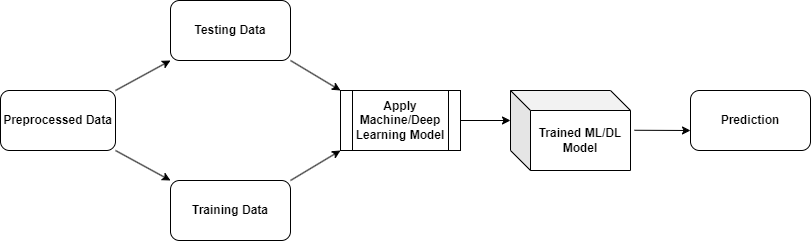
</p>
<p align="center"><em>High-level experimental pipeline used across all models.</em></p>

For full methodology, literature review, and analysis, see:

- [Report/Scarcasm_Detection_major_project_report.pdf](Report/Scarcasm_Detection_major_project_report.pdf)
- [Presentation/Scarcasm_Detection_major_project_presentation.pptx](Presentation/Scarcasm_Detection_major_project_presentation.pptx)

---

## Dataset

### Indian News Sarcastic Headline Dataset

| Property | Details |
|---|---|
| **Total samples** | 8,094 headlines |
| **Classes** | `0` = non-sarcastic, `1` = sarcastic |
| **Balance** | 4,047 sarcastic · 4,047 non-sarcastic |
| **Local file** | [`Dataset/sarcasm-detection-dataset.csv`](Dataset/sarcasm-detection-dataset.csv) |
| **Public release** | [Kaggle — Indian News Sarcastic Headline Dataset](https://www.kaggle.com/datasets/raviutsavk/indian-news-sarcastic-headline-dataset) |

**Sarcastic headlines** were collected from:

- [The Fauxy](https://thefauxy.com/) — 2,128 headlines
- Archived snapshots of [The Unreal Times](https://www.theunrealtimes.com/) via the Wayback Machine — 1,919 headlines

**Non-sarcastic headlines** were added in equal number from formal news sources to balance the dataset. Most headlines are roughly 60–80 characters long.

<p align="center">
  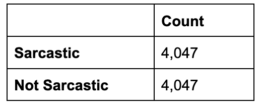
</p>

<p align="center">
  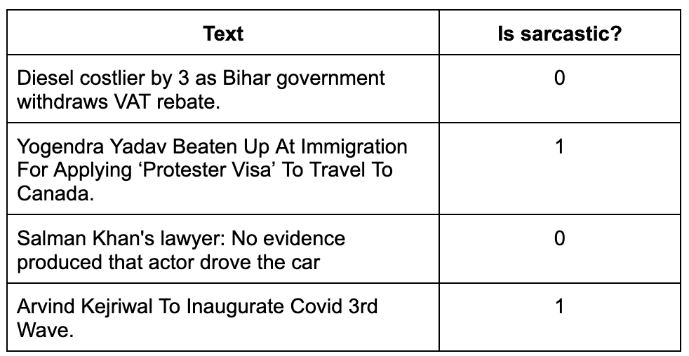
</p>

<p align="center">
  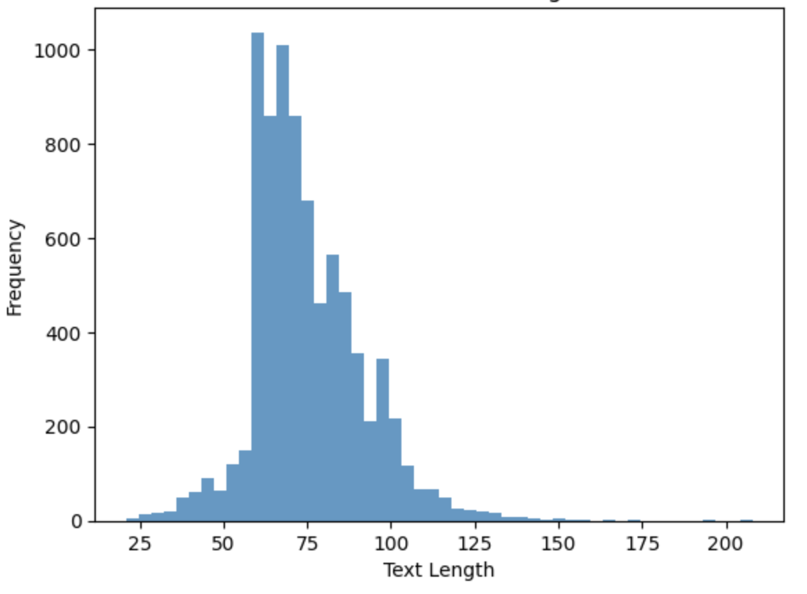
</p>
<p align="center"><em>Most headlines fall in the 60–80 character range.</em></p>

| Sarcastic headlines | Non-sarcastic headlines |
|:---:|:---:|
|  | 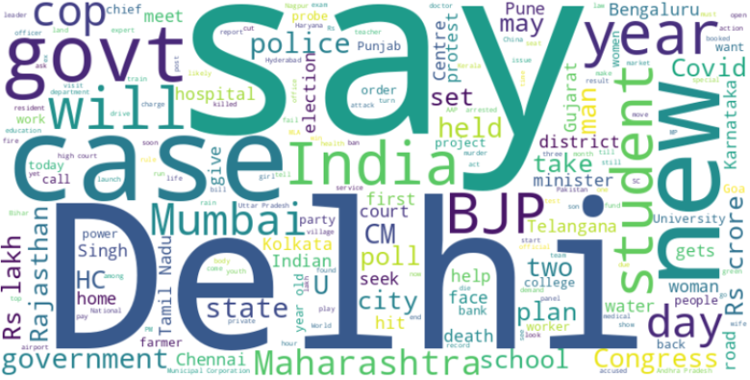 |

**CSV format:**

```csv
,text,label
0,"Diesel costlier by 3 as Bihar government withdraws VAT rebate",0
1,"Yogendra Yadav Beaten Up At Immigration For Applying 'Protester Visa' To Travel To Canada",1
```

### EMOFF_MEME Dataset (Extension)

[`Dataset/Emoff_meme.zip`](Dataset/Emoff_meme.zip) contains the **EMOFF_MEME** dataset from IIT Patna, used to extend sarcasm detection to memes (see paper: *Zombies Eat Brains, You are Safe: A Knowledge Infusion-based Multitasking System for Sarcasm Detection in Meme*). GPT-2 experiments on this dataset are linked in the presentation.

> **Note:** `Emoff_meme.zip` is tracked with Git LFS due to its size. Run `git lfs pull` after cloning if the zip is not present locally.

---

## Methodology

Three modeling strategies were explored, following the architectures documented in the report:

**1. DistilBERT as a frozen feature extractor + classical classifiers**

<p align="center">
  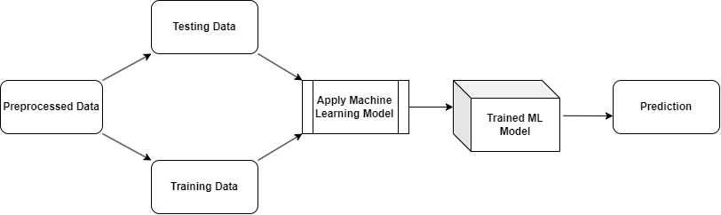
</p>

**2. Frozen DistilBERT + trainable classification head**

<p align="center">
  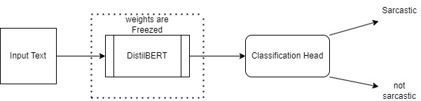
</p>

**3. End-to-end fine-tuning (BERT, RoBERTa, GPT-2, SetFit, LLaMA 2)**

<p align="center">
  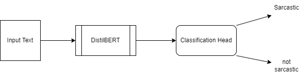
</p>

---

## Results

All models were evaluated on the Indian news headline dataset unless noted. Train/test splits are **80/20** (6,475 train · 1,619 test) with `random_state=42` in most notebooks.

| Approach | Model / Method | Accuracy |
|---|---|---|
| DistilBERT embeddings + classical ML | Logistic Regression | **87.25%** |
| DistilBERT embeddings + classical ML | SVM | **87.75%** |
| DistilBERT embeddings + classical ML | Random Forest | **86.36%** |
| DistilBERT embeddings + classical ML | Naive Bayes | **81.32%** |
| Frozen DistilBERT + classification head | DistilBERT (head only tuned) | **85.8%** |
| Full fine-tuning | BERT (`bert-base-uncased`) | **94.5%** |
| Full fine-tuning | GPT-2 | **95.0%** |
| Full fine-tuning | RoBERTa (`roberta-base`) | **88.7%** |
| Contrastive fine-tuning | SetFit (`all-mpnet-base-v2`) | **96.4%** |
| QLoRA fine-tuning | LLaMA 2 7B | **94.8%** |

<p align="center">
  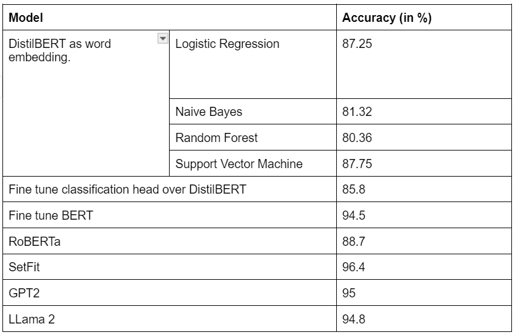
</p>

**Best performer:** SetFit with `sentence-transformers/all-mpnet-base-v2` reached **96.4%** accuracy on the held-out test set.

### DistilBERT embeddings + classical ML

<p align="center">
  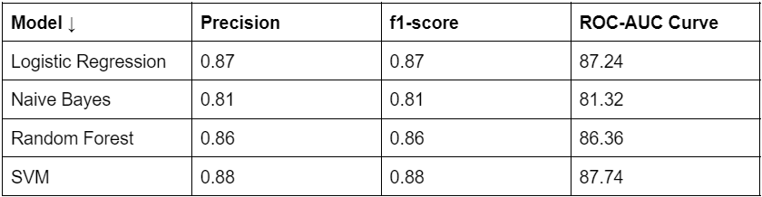
</p>

| Logistic Regression | SVM |
|:---:|:---:|
| 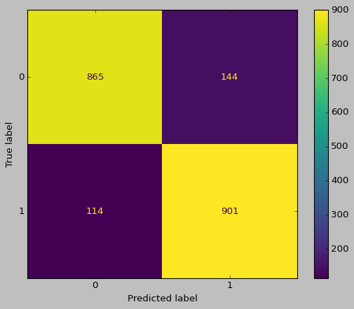 | 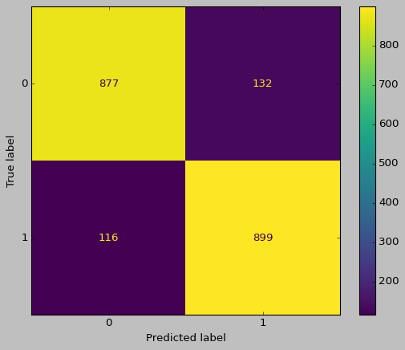 |
| **Random Forest** | **Naive Bayes** |
| 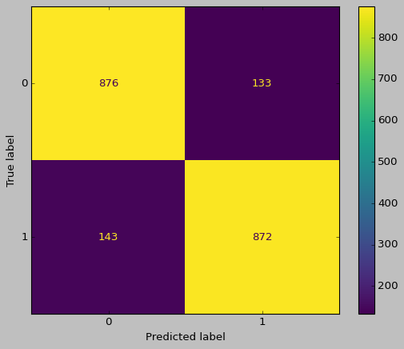 | 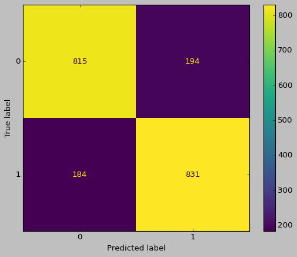 |

### Frozen DistilBERT + classification head

<p align="center">
  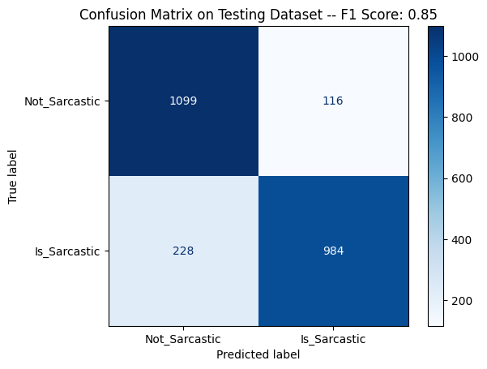
</p>

### GPT-2

<p align="center">
  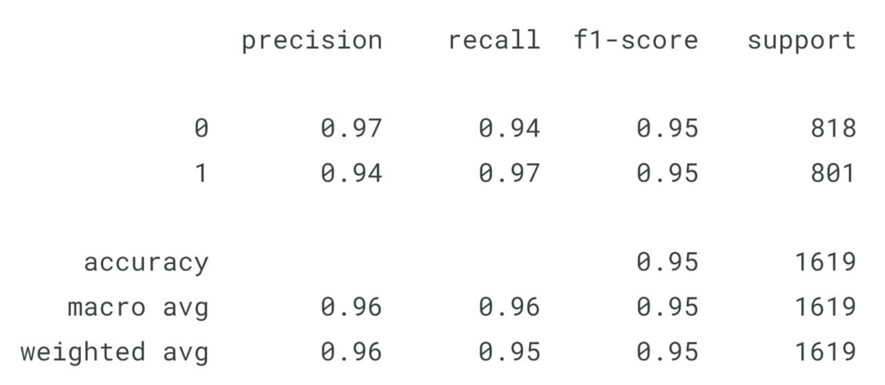
  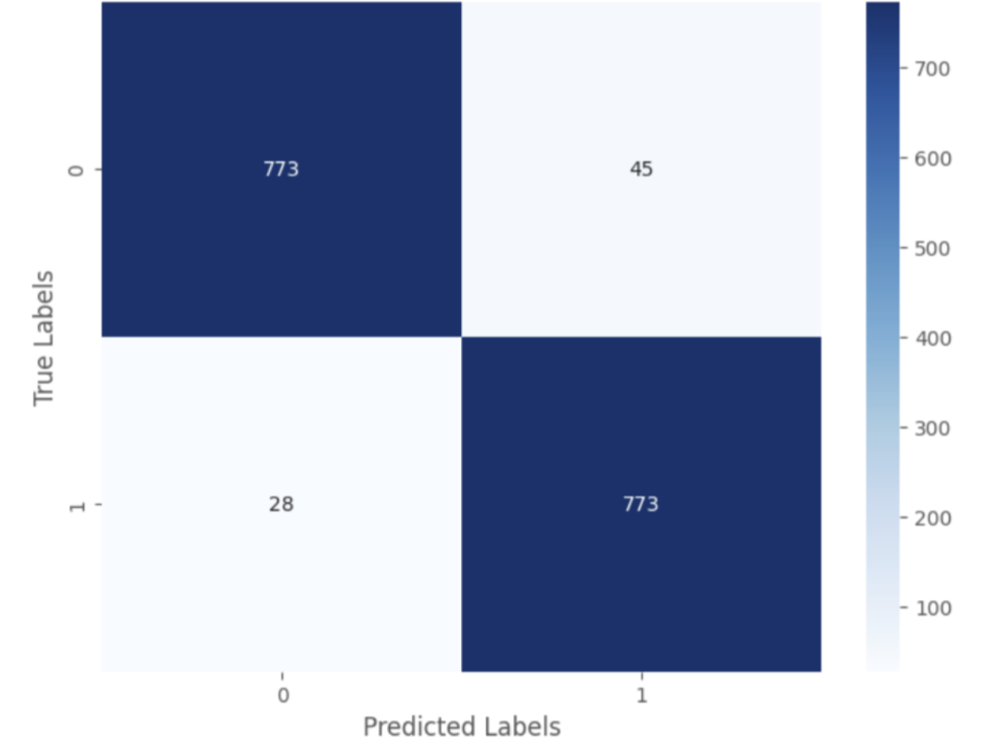
</p>

### SetFit (best model)

<p align="center">
  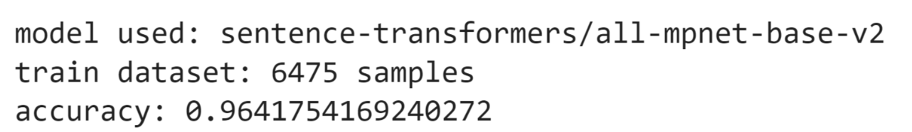
  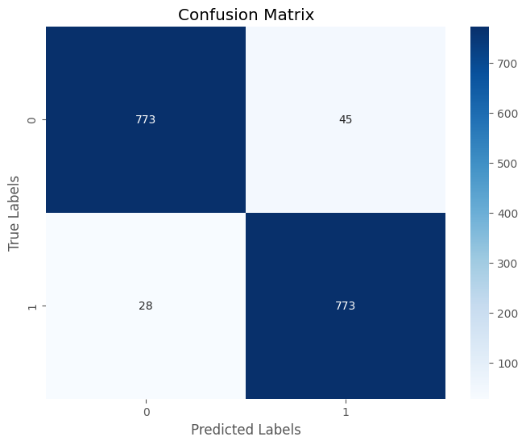
</p>

### LLaMA 2 (QLoRA)

<p align="center">
  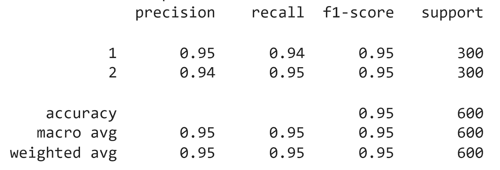
</p>

### Error analysis

Cases where models failed due to missing world knowledge or subtle cues:

<p align="center">
  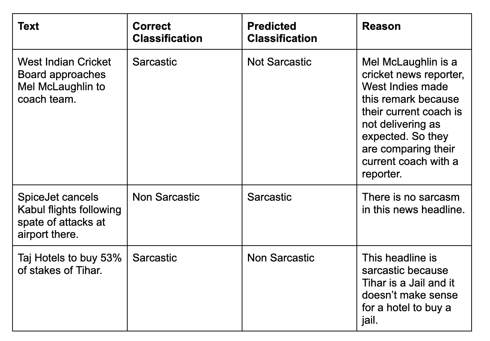
</p>

---

## Repository Structure

```
Sarcasm Detection/
├── Code/                                    # Jupyter notebooks (Colab / Kaggle)
│   ├── Distillbert-as-embedding.ipynb       # DistilBERT features + classical ML
│   ├── distillbertclassification-head.ipynb # Frozen DistilBERT + trainable head
│   ├── distilbert-finetuned.ipynb           # Full BERT fine-tuning
│   ├── SetFit (1).ipynb                     # SetFit contrastive + classifier
│   ├── gpt2.ipynb                           # GPT-2 for sequence classification
│   ├── roberta.ipynb                        # RoBERTa fine-tuning
│   └── llama2-finetune-sarcasm-detection.ipynb  # LLaMA 2 7B with QLoRA
├── Dataset/
│   ├── sarcasm-detection-dataset.csv        # Main dataset (8,094 rows)
│   └── Emoff_meme.zip                       # Meme dataset for extension work
├── Report/
│   ├── Scarcasm_Detection_major_project_report.pdf
│   └── Major_project_documents.pdf
├── Photos/                                  # Figures from the project report
├── Presentation/
│   └── Scarcasm_Detection_major_project_presentation.pptx
└── README.md
```

---

## Getting Started

### Prerequisites

- Python 3.10+
- GPU recommended (notebooks were run on **Google Colab T4** and **Kaggle GPU**)
- [Git LFS](https://git-lfs.github.com/) (for `Emoff_meme.zip`)

### Clone the repository

```bash
git clone https://github.com/Siddhant-Agarwal4583/sarcasm-detection.git
cd sarcasm-detection
git lfs pull
```

### Install dependencies

There is no single `requirements.txt`; each notebook installs what it needs. A typical environment for the transformer notebooks:

```bash
pip install pandas numpy scikit-learn torch transformers datasets evaluate accelerate
pip install setfit sentence-transformers   # for SetFit notebook
pip install peft bitsandbytes trl           # for LLaMA 2 notebook
```

### Run a notebook

1. Open any notebook under [`Code/`](Code/) in Jupyter, Google Colab, or Kaggle.
2. Point the data path to `Dataset/sarcasm-detection-dataset.csv` (notebooks originally use Kaggle/Colab paths like `/kaggle/input/sarcasm-detection-dataset/` — update accordingly).
3. Execute cells top to bottom. GPU runtime is required for transformer fine-tuning.

### Quick reference — key hyperparameters

| Notebook | Base model | Notable settings |
|---|---|---|
| `SetFit (1).ipynb` | `all-mpnet-base-v2` | 80/20 split · batch 64 · 20 contrastive iterations · 1 epoch |
| `distilbert-finetuned.ipynb` | `bert-base-uncased` | 3 epochs · lr 5e-6 · batch 8 · max length 32 |
| `roberta.ipynb` | `roberta-base` | 64/16/20 train/val/test split · lr 5e-5 · 1 epoch |
| `llama2-finetune-sarcasm-detection.ipynb` | LLaMA 2 7B | 4-bit QLoRA · LoRA r=64 · 3 epochs |

---

## Online Notebook Links

The authors also published runnable versions on Colab and Kaggle:

| Experiment | Link |
|---|---|
| SetFit | [Google Colab](https://colab.research.google.com/drive/1FLnP5KQVmU9fer1hekkw41A7e_5ZJOID) |
| BERT fine-tuned | [Google Colab](https://colab.research.google.com/drive/1_fE-CiLerV_Gp8dQmWriHlCEIRTq7zca?usp=sharing) |
| DistilBERT + classification head | [Google Colab](https://colab.research.google.com/drive/1GtnuA-1VTyn5kKrTAjjPntI9oX1r2qT_?usp=sharing) |
| DistilBERT as embedding | [Google Colab](https://colab.research.google.com/drive/1uU9VM4W7_WZeS5b2KbaGK1rZz9rSCPvk?usp=sharing) |
| LLaMA 2 | [Google Colab](https://colab.research.google.com/drive/1LT9lxKAoQcH538xTfYwkZem0bl8Aijgw?usp=sharing) |
| GPT-2 (headlines) | [Kaggle](https://www.kaggle.com/code/siddhantagarwal4583/gpt2-fine-tuning) |
| GPT-2 (EMOFF_MEME) | [Kaggle](https://www.kaggle.com/code/siddhantagarwal4583/fork-of-gpt2-fine-tuning/edit) |
| RoBERTa | [Kaggle](https://www.kaggle.com/code/siddhantagarwal4583/roberta-fine-tuning-3) |

---

## Applications

- **Social media monitoring** — interpret sarcastic posts more accurately in sentiment pipelines.
- **Review and feedback analysis** — separate genuine praise from sarcastic criticism.
- **Moderation** — flag sarcastic hate speech or cyberbullying that literal models miss.

---

## Related Work

Key references covered in the report and presentation:

- Joshi & Bhattacharyya (2017) — *Automatic Sarcasm Detection: A Survey*
- Devlin et al. (2018) — *BERT*
- Liu et al. (2019) — *RoBERTa*
- Radford et al. (2019) — *GPT-2*
- Sanh et al. (2020) — *DistilBERT*
- Tunstall & Reimers (2022) — *SetFit*
- Misra & Arora (2022) — *Sarcasm Detection using Hybrid Neural Network*

---

## Future Work

- Domain-specific fine-tuning (social media, forums, regional languages)
- **Multimodal sarcasm detection** combining text and images (memes via EMOFF_MEME)
- Cross-lingual sarcasm detection for Indian languages

---

## License

This repository is an academic major project submission. Please cite or contact the authors before reusing the dataset or report in published work.

---

## Citation

If you use the dataset or this work, please reference:

> Siddhant Agrawal, Ravi Utsav, Shreyans Jain. *Sarcasm Detection in Indian News Headlines.* Major Project, Department of IT, IIIT Allahabad, 2024.  
> Dataset: [Kaggle — Indian News Sarcastic Headline Dataset](https://www.kaggle.com/datasets/raviutsavk/indian-news-sarcastic-headline-dataset)
